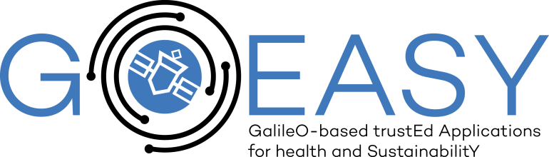

# GoEasy

## **The project**

The GOEASY project will provide the technical and business foundations to enable a new generation of trusted and dependable mass-market Location Based Services and Applications to engage, stimulate and reward citizens for more sustainable behaviours and healthier choices.

This three-years project contributes to the consolidation of an environmentally aware and engaged public community in the EU, while delivering added value innovative solutions for Location Based Services and opening new scenarios and opportunities for Smart  City solutions (by enabling innovative LBS and IoT services). The research outputs are relevant for EU citizens lives, promoting a healthier environment, increasing sustainability in cities, creating employment opportunities and improving existing technologies.

GNSS user technology is now widely available in mass market devices including personal devices, connected vehicles, Internet of Things (IoT) objects, etc. The widespread availability of GNSS receivers, joint with ubiquitous communication capabilities of devices and the ability of cloud-based ICT platforms to federate with each other through open standards and APIs, is enabling a new generation of Location Based Services (LBS) able to support highly-scalable pervasive applications where large number of geographically-distributed users are engaged e.g. in immersive games and commercial services.

While GNSS proves to be able to support such applications successfully, a major drawback prevents such approach to be used in more serious (and potentially highly rewarding) mass market applications i.e. the lack of authentication features, resulting in high difficulties in preventing users from spoofing position information to gain advantages or damage other users.

GOEASY will be evaluated by means of two concrete use cases, namely the ApesMobility and the AsthmaWatch, both evaluated engaging real users in a medium-scale pilot in Torino (Italy) and Stockholm (Sweden).

### *U-Blox Reference System*

The main purpose of this system is to provide real-time and historical collections of GALILEO navigation messages, to be used by the e-Security Infrastructure components of the GOEASY Platform as reference values within the authentication process of location-based data. The information provided by the reference systems are essential for the position authentication algorithm executed on the GOEASY Platform. Through the mechanisms developed, the e-Security Infrastructure can assure with a certain degree of confidence that third-party computed positions have not been compromised without requiring additional computations on external applications that wants to exploit such system.

### *U-Blox Reader*

It is a python-based software developed exploited the async paradigm.
During boot, it configures the U-blox receiver to filter Galileo navigation messages and oversees the serial port connected to it. It is also in charge of setting up the local PostgreSQL database, the tables and to dynamically fill in the entries with the data received. The design process led to the definition of the following structures to prevent tables to grow excessively with respect to the necessary performances required by the system.
Each one of the messages, after being parsed, is asynchronously given to the Position alteration detection library implementing the OS-NMA algorithm. The results of such process will update the authenticity field of the persistently stored navigation message.

### *U-Blox API*

It is a python-based software developed exploited the async paradigm through the FastAPI framework.
During boot, it interacts with Keycloak server and dynamically configures the OAuth2 security settings of the exposed REST endpoints.
The main purpose is to provide a public and secure interface to let SERENGETI, or other systems, to obtain secure Galileo data to be used as reference. The data extraction interfaces allow the parametrization of the specific satellite and timeframe of interest. When it receives a request, granted via Oauth2 tokens, it extracts from the PostgreSQL database the raw information of interest and embed them in a JSON response.
It is in charge to feed the GOEASY platform with the necessary data to apply comparison and thresholds algorithms for the third-party lbs-data that needs to be authenticated.